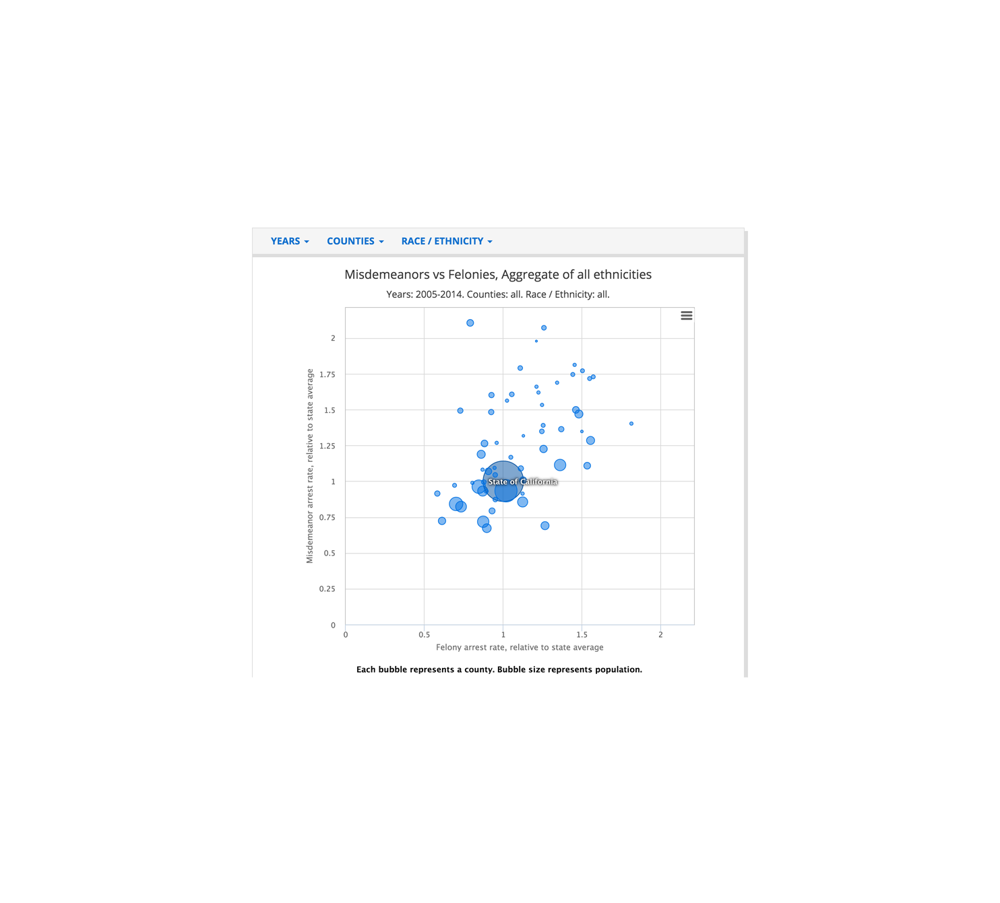
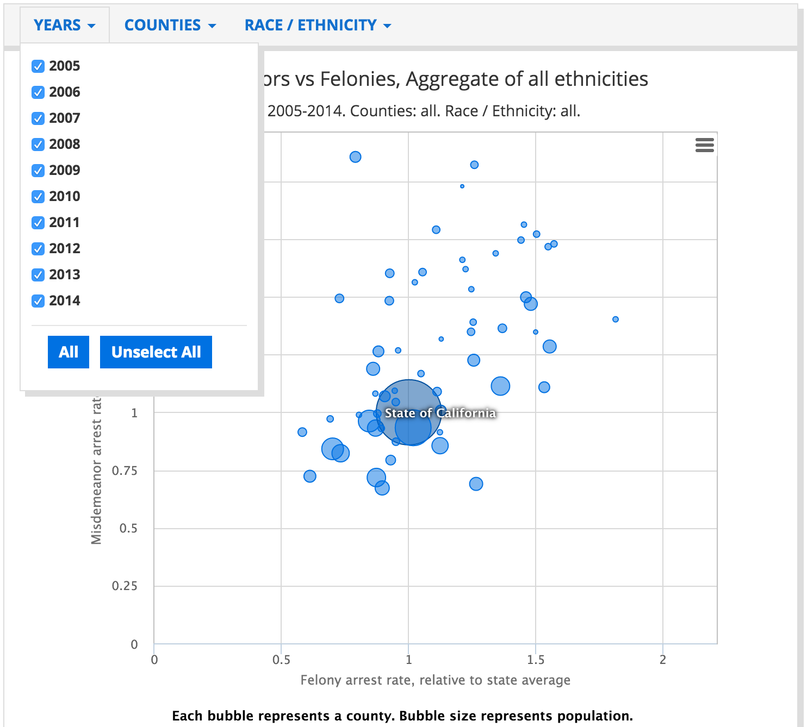
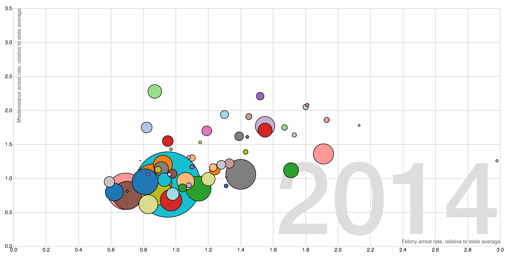

Are you interested in one of the datasets on the [OpenJustice CA portal][OJ], but you want visualize it differently from their default? This is a walkthrough of how two hackers at the [National Day of Civic Hacking][NDoCH] identified a problem in one of the OpenJustice visualizations, and  created a new, better visualization to improve OpenJustice.

[OJ]: http://openjustice.doj.ca.gov/
[NDoCH]: https://www.eventbrite.com/e/national-day-of-civic-hacking-tickets-25188025061

## Objective: Improve DOJ Visualization

This is the OpenJustice visualization that <a href="https://github.com/saikirandulla" class="github-username">@saikirandulla</a> and <a href="https://github.com/aprilw" class="github-username">@aprilw</a> were looking at:



It plots [the rates of misdemeanor vs felony arrests by county](http://openjustice.doj.ca.gov/agencies/charts), providing a notion of the spread. They wondered, how has that changed over time? Well, you can filter by year:




## Limitation

Okay...that provides the information we want, but given the filtering, it makes it hard to view time trends over time. The hackers decided to fix this.

##Inspiration for Improvement

The interactive animation "The Wealth & Health of Nations" suggests one possibility for imporvement: displaying on year at a time, and animating the time parameter:

[](https://bost.ocks.org/mike/nations/)

##Original JS for visualization


```
function x(d) { return d.income; }
function y(d) { return d.lifeExpectancy; }
function radius(d) { return d.population; }
function color(d) { return d.region; }
function key(d) { return d.name; }

// Chart dimensions.
var margin = {top: 19.5, right: 19.5, bottom: 19.5, left: 39.5},
    width = 960 - margin.right,
    height = 500 - margin.top - margin.bottom;

// Various scales. These domains make assumptions of data, naturally.
var xScale = d3.scale.log().domain([300, 1e5]).range([0, width]),
    yScale = d3.scale.linear().domain([10, 85]).range([height, 0]),
    radiusScale = d3.scale.sqrt().domain([0, 5e8]).range([0, 40]),
    colorScale = d3.scale.category10();

// The x & y axes.
var xAxis = d3.svg.axis().orient("bottom").scale(xScale).ticks(12, d3.format(",d")),
    yAxis = d3.svg.axis().scale(yScale).orient("left");

// Create the SVG container and set the origin.
var svg = d3.select("#chart").append("svg")
    .attr("width", width + margin.left + margin.right)
    .attr("height", height + margin.top + margin.bottom)
  .append("g")
    .attr("transform", "translate(" + margin.left + "," + margin.top + ")");

// Add the x-axis.
svg.append("g")
    .attr("class", "x axis")
    .attr("transform", "translate(0," + height + ")")
    .call(xAxis);

// Add the y-axis.
svg.append("g")
    .attr("class", "y axis")
    .call(yAxis);

// Add an x-axis label.
svg.append("text")
    .attr("class", "x label")
    .attr("text-anchor", "end")
    .attr("x", width)
    .attr("y", height - 6)
    .text("income per capita, inflation-adjusted (dollars)");

// Add a y-axis label.
svg.append("text")
    .attr("class", "y label")
    .attr("text-anchor", "end")
    .attr("y", 6)
    .attr("dy", ".75em")
    .attr("transform", "rotate(-90)")
    .text("life expectancy (years)");

// Add the year label; the value is set on transition.
var label = svg.append("text")
    .attr("class", "year label")
    .attr("text-anchor", "end")
    .attr("y", height - 24)
    .attr("x", width)
    .text(1800);

// Load the data.
d3.json("nations.json", function(nations) {

  // A bisector since many nation's data is sparsely-defined.
  var bisect = d3.bisector(function(d) { return d[0]; });

  // Add a dot per nation. Initialize the data at 1800, and set the colors.
  var dot = svg.append("g")
      .attr("class", "dots")
    .selectAll(".dot")
      .data(interpolateData(1800))
    .enter().append("circle")
      .attr("class", "dot")
      .style("fill", function(d) { return colorScale(color(d)); })
      .call(position)
      .sort(order);

  // Add a title.
  dot.append("title")
      .text(function(d) { return d.name; });

  // Add an overlay for the year label.
  var box = label.node().getBBox();

  var overlay = svg.append("rect")
        .attr("class", "overlay")
        .attr("x", box.x)
        .attr("y", box.y)
        .attr("width", box.width)
        .attr("height", box.height)
        .on("mouseover", enableInteraction);

  // Start a transition that interpolates the data based on year.
  svg.transition()
      .duration(30000)
      .ease("linear")
      .tween("year", tweenYear)
      .each("end", enableInteraction);

  // Positions the dots based on data.
  function position(dot) {
    dot .attr("cx", function(d) { return xScale(x(d)); })
        .attr("cy", function(d) { return yScale(y(d)); })
        .attr("r", function(d) { return radiusScale(radius(d)); });
  }

  // Defines a sort order so that the smallest dots are drawn on top.
  function order(a, b) {
    return radius(b) - radius(a);
  }

  // After the transition finishes, you can mouseover to change the year.
  function enableInteraction() {
    var yearScale = d3.scale.linear()
        .domain([1800, 2009])
        .range([box.x + 10, box.x + box.width - 10])
        .clamp(true);

    // Cancel the current transition, if any.
    svg.transition().duration(0);

    overlay
        .on("mouseover", mouseover)
        .on("mouseout", mouseout)
        .on("mousemove", mousemove)
        .on("touchmove", mousemove);

    function mouseover() {
      label.classed("active", true);
    }

    function mouseout() {
      label.classed("active", false);
    }

    function mousemove() {
      displayYear(yearScale.invert(d3.mouse(this)[0]));
    }
  }

  // Tweens the entire chart by first tweening the year, and then the data.
  // For the interpolated data, the dots and label are redrawn.
  function tweenYear() {
    var year = d3.interpolateNumber(1800, 2009);
    return function(t) { displayYear(year(t)); };
  }

  // Updates the display to show the specified year.
  function displayYear(year) {
    dot.data(interpolateData(year), key).call(position).sort(order);
    label.text(Math.round(year));
  }

  // Interpolates the dataset for the given (fractional) year.
  function interpolateData(year) {
    return nations.map(function(d) {
      return {
        name: d.name,
        region: d.region,
        income: interpolateValues(d.income, year),
        population: interpolateValues(d.population, year),
        lifeExpectancy: interpolateValues(d.lifeExpectancy, year)
      };
    });
  }

  // Finds (and possibly interpolates) the value for the specified year.
  function interpolateValues(values, year) {
    var i = bisect.left(values, year, 0, values.length - 1),
        a = values[i];
    if (i > 0) {
      var b = values[i - 1],
          t = (year - a[0]) / (b[0] - a[0]);
      return a[1] * (1 - t) + b[1] * t;
    }
    return a[1];
  }
});
```

##Changes to the Code

```
Insert the changes to code here
```

There was also a need to create a python script to convert a csv file into the correct json format. Code for this here.
```
import csv
import json
import sys, getopt

'''
To run (from inside this directory):
python data_converter.py -i ../data/data_clean.csv -o ../data/test.json
(from main directory)
python scripts/data_converter.py -i data/data_clean.csv -o data/test.json
'''

def main(argv):
  input_file = ''
  output_file = ''
  try:
      opts, args = getopt.getopt(argv,"hi:o:",["ifile=","ofile="])
  except getopt.GetoptError:
      print('data_converter.py -i <path to inputfile> -o <path to outputfile>')
      sys.exit(2)
  for opt, arg in opts:
      if opt == '-h':
          print('data_converter.py -i <path to inputfile> -o <path to outputfile>')
          sys.exit()
      elif opt in ("-i", "--ifile"):
          input_file = arg
      elif opt in ("-o", "--ofile"):
          output_file = arg
  csv_to_json(input_file, output_file)

def csv_to_json(file, json_file):
  csv_rows = []
  with open(file) as csvfile:
    reader = csv.DictReader(csvfile)
    title = reader.fieldnames
    counties = {}

    for row in reader:
      if row['county'] in counties:
        counties[row['county']]['felony'].append([int(row['year']), float(row['felony'])])
        counties[row['county']]['misdemeanor'].append([int(row['year']), float(row['misdemeanor'])])
        counties[row['county']]['population'].append([int(row['year']), int(row['population'])])

      else:
        counties[row['county']] = {'county': row['county']}
        counties[row['county']]['felony'] = [[int(row['year']), float(row['felony'])]]
        counties[row['county']]['misdemeanor'] = [[int(row['year']), float(row['misdemeanor'])]]
        counties[row['county']]['population'] = [[int(row['year']), int(row['population'])]]


    print(counties.values())
    write_json(list(counties.values()), json_file)
     

def write_json(data, json_file):
  with open(json_file, "w") as f:
    f.write(json.dumps(data, sort_keys=True, indent=4, separators=(',', ': '),ensure_ascii=False))

if __name__ == "__main__":
   main(sys.argv[1:])

```


## Final Visualization

This is the result of all the hard work!



[And a link to the interactive version](http://openjustice.github.io/mvsf/)
