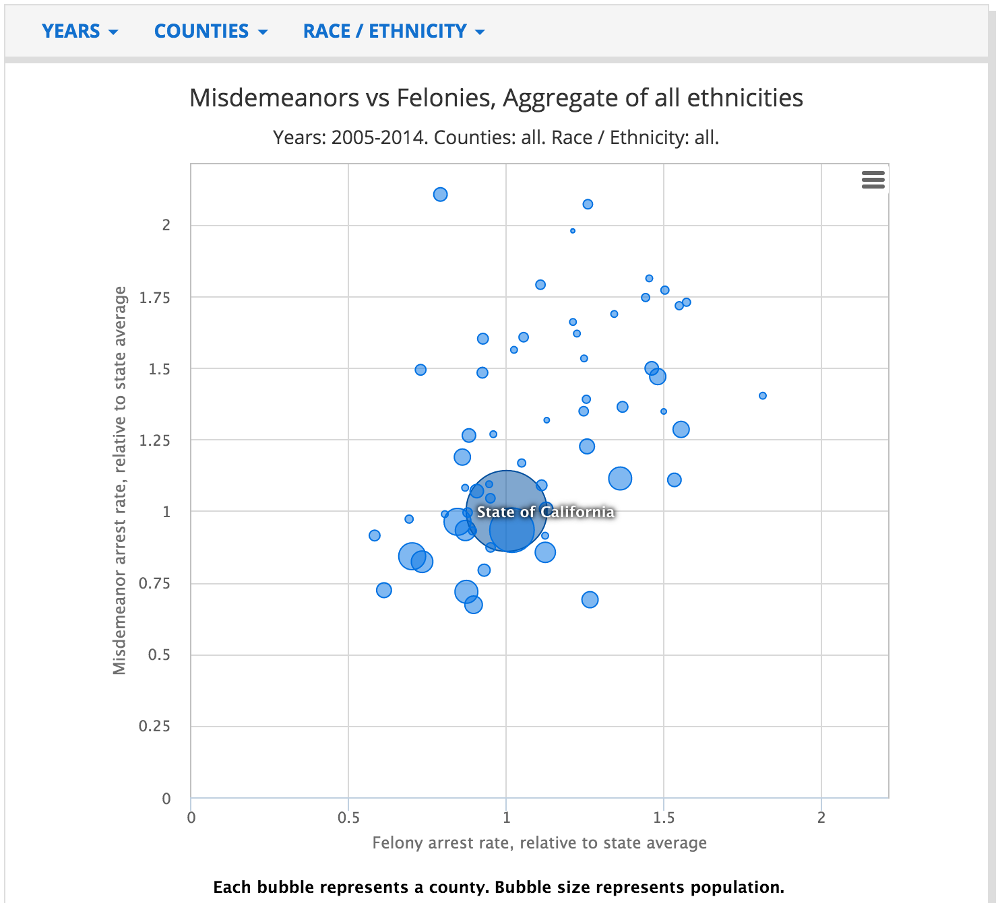
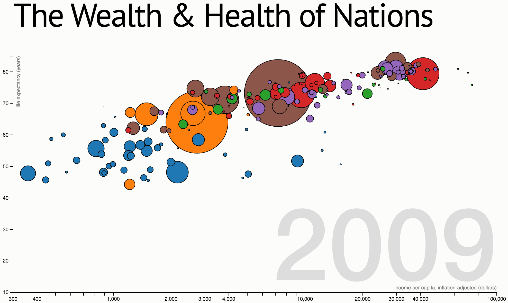

Are you interested in one of the datasets on the [OpenJustice CA portal][OJ], but you want visualize it differently from their default? This is a walkthrough of how two hackers at the [National Day of Civic Hacking][NDoCH] identified a deficiency [TKTK awkward wording] in one of the OpenJustice visualizations, and adapted a visualization of some other dataset to the OpenJustice data.

[OJ]: http://openjustice.doj.ca.gov/
[NDoCH]: https://www.eventbrite.com/e/national-day-of-civic-hacking-tickets-25188025061

This is the OpenJustice visualization that <a href="https://github.com/saikirandulla" class="github-username">@saikirandulla</a> and <a href="https://github.com/aprilw" class="github-username">@aprilw</a> were looking at:

It plots [the rates of misdemeanor vs felony arrests by county](http://openjustice.doj.ca.gov/agencies/charts), providing a notion of the spread. They wondered, how has that changed over time? Well, you can filter by year:

Okay...that provides the information we want, yet completely obscures the information we want. How can we see how these ratios have trended over time?

The interactive animation "The Wealth & Health of Nations" suggests one possibility: displaying on year at a time, and animating the time parameter:

## TO BE CONTINUED

This will eventually be a walkthrough of the Misdemeanors vs Felonies visualization:

It was generated from Markdown, so that's cool!
